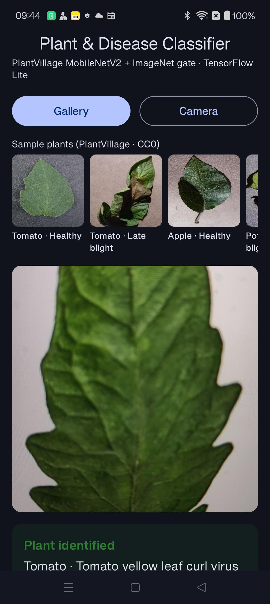
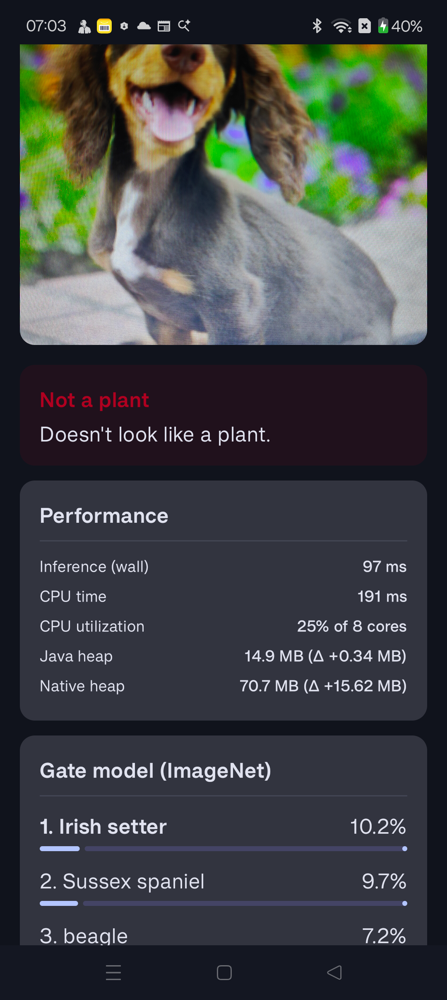

# OnDeviceModelSample

On-device Android app that classifies a photo as **plant** or **not a plant**, and when it's a plant, identifies the **crop** and **disease/healthy state**. Runs entirely offline with TensorFlow Lite — no network, no server. Built with Jetpack Compose.

## Screenshots

| Plant identified (gallery → sample) | Non-plant rejected (camera → dog) |
| --- | --- |
|  |  |

## How it works

Two TFLite models run as a chain. The order matters — and was deliberately chosen this way to stop the disease model from hallucinating diseases on non-plant inputs.

1. **ImageNet gate** (`model.tflite`, MobileNetV2, 1001 classes) runs **first**.
   - If top-1 is a clearly non-plant class (`golden retriever`, `sports car`, etc.) with confidence ≥ `GATE_REJECT_THRESHOLD` → return **Not a plant**. Disease model isn't even run.
   - If top-1 is in a curated plant allowlist (`banana`, `daisy`, `corn`, `mushroom`, …) with confidence ≥ `GATE_PLANT_THRESHOLD` → confirmed plant; pass to step 2.
   - Otherwise the gate is ambiguous (typical for close-up leaf shots, where ImageNet has no clean class) — fall through to step 2 with a stricter bar.
2. **PlantVillage MobileNetV2** (`plant_disease_model.tflite`, 38 classes) runs second.
   - If gate confirmed plant: accept disease label at confidence ≥ `PLANT_ACCEPT_THRESHOLD`. Below that, "plant detected, disease unclear".
   - If gate was ambiguous: require a much higher `STRICT_PLANT_THRESHOLD` to accept (PlantVillage's softmax sums to 1.0 even on garbage input, so the strict bar is what stops dogs being called "corn maize").

Each model has its own preprocessing pipeline:

| Model | Input | Normalization |
| --- | --- | --- |
| ImageNet gate | 224×224×3 | `(p − 127.5) / 127.5` → `[-1, 1]` |
| PlantVillage | 224×224×3 | `p / 255` → `[0, 1]` |

## What's in the box

- `assets/model.tflite` + `labels.txt` — ImageNet MobileNetV2, 1001 classes (gate model)
- `assets/plant_disease_model.tflite` + `plant_labels.txt` — PlantVillage MobileNetV2, 38 classes
  (14 crops: apple, blueberry, cherry, corn, grape, orange, peach, bell pepper, potato, raspberry, soybean, squash, strawberry, tomato — healthy + 24 diseases)
- `assets/samples/*.jpg` — 6 known-good leaf images from the canonical PlantVillage dataset, displayed as a tap-to-classify row in the UI
- Two-stage classifier in `ImageClassifier.kt`
- Per-classification performance card (wall time, CPU time, CPU utilization, Java/native heap before/after)
- Always-visible device card (model, Android version, ABI, cores, system RAM, max heap) — useful for cross-device benchmarking

## Build

Standard Android project. The catch: the toolchain auto-download from `api.foojay.io` and `raw.githubusercontent.com` are blocked on some corporate networks. If `./gradlew assembleDebug` fails to fetch a JDK 21 toolchain, point Gradle at Android Studio's bundled JBR:

```properties
# gradle.properties
org.gradle.java.home=/Applications/Android Studio.app/Contents/jbr/Contents/Home
```

Or set `JAVA_HOME` in the environment before running `./gradlew`.

## Tuning

All thresholds live as constants in `app/src/main/java/com/example/ondevicemodelsample/ml/ImageClassifier.kt`:

| Constant | Default | Effect of raising | Effect of lowering |
| --- | --- | --- | --- |
| `GATE_REJECT_THRESHOLD` | `0.55f` | More non-plants leak into PlantVillage | More aggressive non-plant rejection (risks rejecting wide-scene camera shots of real plants) |
| `GATE_PLANT_THRESHOLD` | `0.30f` | Fewer images confirmed as plants by the gate | More gate-confirmed plants |
| `PLANT_ACCEPT_THRESHOLD` | `0.55f` | Fewer disease calls (more "plant detected, disease unclear") | More confident disease calls |
| `STRICT_PLANT_THRESHOLD` | `0.75f` | Almost no plants pass through the ambiguous-gate path | OOD images may be misclassified as plants |

Plant allowlist (which ImageNet labels count as "plant" for the gate) is in the same file, and is intentionally inclusive — fruits, vegetables, flowers, mushrooms, common plant parts.

## Limitations (be honest about these before shipping)

- **No pest classification.** No widely-distributed pre-trained TFLite for IP102 / HQIP102 — adding pests requires training a model.
- **Not India-specific.** PlantVillage is global. Indian-specific work like CropLeafNet (Gujarat cotton/castor, 2025) doesn't publish a downloadable TFLite. Crops covered still include most major Indian-relevant ones (tomato, potato, corn, grape, pepper, etc.).
- **First inference is slow.** TFLite has model-load + tensor-allocation cost on the first call (~hundreds of ms). Discard run #1 when benchmarking; measure the median of runs 2–N.
- **CPU governor noise.** Two consecutive runs on the same phone can differ 2–3× due to thermal/frequency scaling. Always run 5–10× and report median.
- **Photographing-a-screen rarely works.** Moiré + glare + the surrounding scene confuse both models. Use the bundled `samples/` row for a known-good baseline; download online images directly to the gallery rather than photographing them on a monitor.

## Models & data — credits

- Gate model: standard MobileNetV2 (ImageNet, 1001 classes including the `background` class).
- Plant disease model + 38-class label list: [obeshor/Plant-Diseases-Detector](https://github.com/obeshor/Plant-Diseases-Detector) (PlantVillage MobileNetV2 transfer-learning checkpoint).
- Sample leaf images: [spMohanty/PlantVillage-Dataset](https://github.com/spMohanty/PlantVillage-Dataset) (CC0 1.0 / CC BY 3.0).